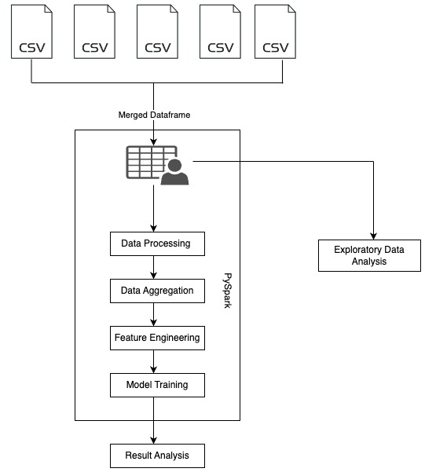
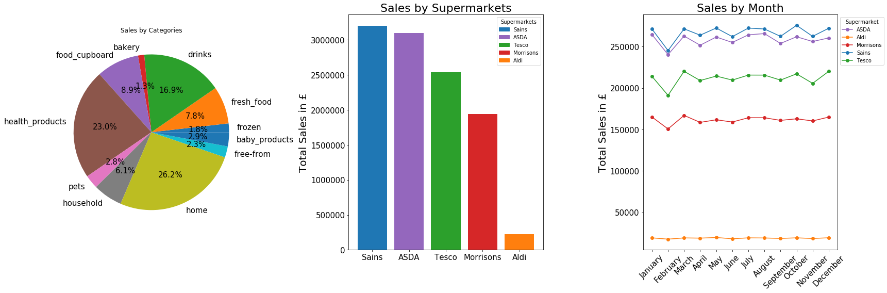
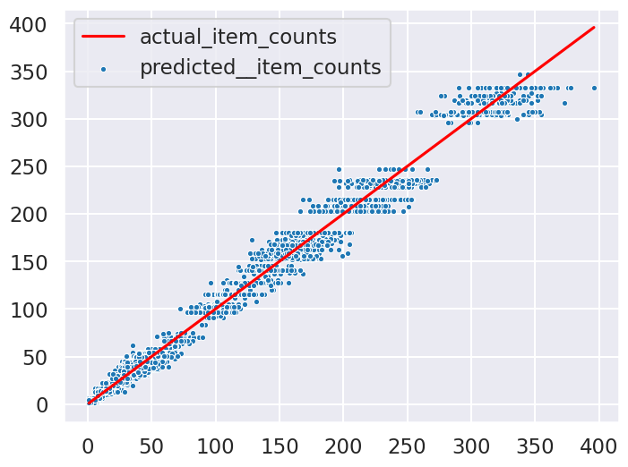

# Retail Analytics with Big Data Using Apache Spark

**Authors:**  
Akash Shingha Bappy (2307938)  
Shakib Polock (2307673)  
K H M Burhan Uddin (2307264)  
Mitun Paul (2307325)  

## Table of Contents

- [Introduction](#introduction)
- [Related Works](#related-works)
- [Project Description](#project-description)
- [Data Description](#data-description)
- [Methodologies and Tools](#methodologies-and-tools)
- [Data Processing](#data-processing)
- [Data Aggregation](#data-aggregation)
- [Feature Engineering](#feature-engineering)
- [Model Training](#model-training)
- [Data Analysis](#data-analysis)
- [Results](#results)
- [Contribution Report](#contribution-report)
- [Conclusion](#conclusion)
- [References](#references)

## Introduction

Big data accounts for massive amounts of data both structured and unstructured sourced from diverse channels such as social media, sensors, mobile devices, and transaction records. The digital revolution has spurred an unprecedented surge in data generation, with platforms like social media and IoT devices contributing extensively. This abundance of data necessitates robust strategies for effective utilization. Big data’s capabilities are multifaceted, notably its capacity for high-speed analysis of large datasets. Advanced analytics techniques like machine learning enable real-time extraction of insights, facilitating tasks such as predictive analytics for businesses.

In the retail sector, big data encompasses a plethora of transactional sales data gathered from different sources like social media interactions, online transactions, customer feedback, and supply chain operations. Its indispensability for supermarkets and grocery stores stems from the inadequacy of traditional data processing methods to handle the sheer volume of data generated. Big data technologies enable real-time storage, processing, and analysis of massive datasets, offering actionable insights at scale.

## Related Works

Use cases for big data tools and applications in retail have attracted considerable attention, driven by the rise of connected devices and mobile apps. Current literature and expert insights highlight key areas of focus in retail logistics. Granular sales data improves choices about availability and assortment, while historical sales data and loyalty programs provide insightful customer information for operational planning. External data sources like competitor prices and weather patterns offer opportunities for demand forecasts and pricing strategies.

Despite its advantages, the adoption of big data in retail encounters obstacles including a lack of expertise, difficulties in IT integration, and managerial reservations about data sharing. To overcome these issues, a suggested data maturity profile for retail enterprises has been developed to direct future research and address these challenges. The literature emphasizes big data’s transformative potential in assortment planning, pricing strategies, and store layout design to enhance operational efficiencies.

## Project Description

The retail industry is undergoing a significant transformation due to advanced technology and changing consumer preferences. In our project, we explore how big data tools can help retail chains generate insights from customer data, aiming to derive descriptive and predictive analysis that can reshape the superstore industry. Our goal is to translate raw data into actionable intelligence that drives strategic decision-making and propels business growth.

## Data Description

The dataset for our analysis comes from the “Retail Analytics Trends” project on Kaggle, which is publicly accessible under the CC0: Public Domain license. The dataset encompasses comprehensive product information from leading UK supermarkets, such as Aldi, ASDA, Morrisons, Sainsbury’s, and Tesco, providing a rich source for market trend analysis. It comprises over 2.1 million records, organized into different files corresponding to the aforementioned supermarkets.

### Data Schema

| Field Name   | Description                           | Type   | Example                  |
|--------------|---------------------------------------|--------|--------------------------|
| Store_name   | Name of the supershop                 | String | Aldi                     |
| Price        | Price of product                      | Float  | 2.30 (£)                 |
| Price_unit   | Price per unit                        | Float  | 5.50                     |
| Measure_unit | Measurement unit of sold product      | String | Kg                       |
| Product_name | Name of sold products                 | String | Xbox Series X Console    |
| Date         | Date of sale                          | Date   | 2023-11-01               |
| Category     | Product category                      | String | Frozen                   |
| Own_brand    | Whether the product is an own brand   | Boolean| Yes                      |

## Methodologies and Tools

### Data Processing

The dataset consisted of five large CSV files containing data for different supermarkets. These files were read through Spark and merged into a single DataFrame. Unnecessary columns were dropped for faster processing, and the date column was cast as a date type and transformed using PySpark.

### Data Aggregation

To predict the amount of product needed to be stocked on a particular day, we aggregated the data based on the supermarket, date, month, and product category. The count represents the amount of stock that needs to be preserved within a particular day of the month in a supermarket’s product category.

### Feature Engineering

The categorical data in the columns 'supermarket' and 'product_category' were encoded into numerical values using PySpark’s StringIndexer function. A new feature named 'day' was created from the 'dd-mm-yyyy' date column. A VectorAssembler was applied to create a vector space incorporating all features.

### Model Training

A Decision Tree regressor from PySpark MLlib was used for model training. The data was split into 80% for training and 20% for testing, with a 'maxDepth' of 6 to prevent overfitting.

## Data Analysis

We utilized PySpark to aggregate a dataset, generating key insights and transforming raw data into meaningful information that elucidates sales distributions and market dynamics within the supermarket sector. After preparing the final dataset, we used pandas, Matplotlib, and Seaborn to create visualizations. This big data processing and analysis allowed us to effectively summarize and visualize crucial business metrics.

The resulting visualizations distinctively highlight supermarket sales. The pie chart shows that health products and home goods are the most popular, commanding approximately 23% and 26.2% of the market respectively. Drinks also make a significant contribution, while bakery items have the smallest share of 1.3%. In the bar chart, Sains leads with total sales of approximately 3.20 million, closely followed by ASDA at around 3.10 million, with Aldi at the lower end with about 0.25 million.

The top 10 selling products overall and across specific supermarkets reveal distinct consumer preferences, reflecting both overall trends and individual supermarket demographics. Globally, high-end electronics, personal care items, and home cleaning products dominate, with items like the Xbox Series X Console, Oral-B toothbrushes, and Shark vacuum cleaners leading the sales.

The sales data reveals a dominant preference for non-own brand products across various supermarkets, accounting for around 82% of total sales, compared to about 18% for own brand products. This trend is almost consistent across major retailers like Sains, Aldi, Tesco, and Morrisons, where non-own brands significantly outperformed own brands.

## Results

We employed a number of key performance indicators (KPIs) to assess our model’s effectiveness on the test dataset. Strong fit was demonstrated by the remarkable 0.9861 obtained by the R-squared (R²) statistic, which measures the amount of variance in the dependent variable that is explained by the independent variables. The average departure of the predictions from the actual data was indicated by the Root Mean Squared Error (RMSE) of 11.2828. The average squared difference was measured by the Mean Squared Error (MSE) of 127.301, while the average absolute deviation was shown by the Mean Absolute Error (MAE) of 8.12435. The map displaying the alignment between projected and actual values demonstrates the great prediction accuracy and precision of our model, which are highlighted by these measures.

## Contribution Report

- **Data Processing:** Shakib Polock and Akash Bappy
- **Data Visualization:** Mitun Paul and K H M Burhan Uddin
- **Machine Learning:** Shakib Polock and Akash Bappy
- **Documentation and Report Writing:** K H M Burhan Uddin and Mitun Paul
- **Literature Review:** Akash Bappy

## Conclusion

In this project, we utilized big data analytics in retail using Apache Spark, focusing on UK supermarkets. Our analysis highlighted key sales trends, customer behavior, and potential for predictive modeling in inventory management. Despite limitations like dataset constraints and the lack of hyperparameter tuning, our model showed strong accuracy. Future work includes exploring customer segmentation and market basket analysis.

## References

1. Norjihan Abdul Ghani, et al. Social media big data analytics: A survey. *Computers in Human Behavior*, 101:417–428, 2019. 
2. Mahya Seyedan and Fereshteh Mafakheri. Predictive big data analytics for supply chain demand forecasting: methods, applications, and research opportunities. *Journal of Big Data*, 7(1):53, Jul 2020.
3. Muhammad Imran Razzak, et al. Big data analytics for preventive medicine. *Neural Computing and Applications*, 32(9):4417–4451, May 2020.
4. Xueqi Cheng, et al. Combating emerging financial risks in the big data era: A perspective review. *Fundamental Research*, 1(5):595–606, 2021.
5. Marta Fernandes, et al. Data analysis and feature selection for predictive maintenance: A case-study in the metallurgic industry. *International Journal of Information Management*, 46:252–262, 2019.
6. A. H. P. K. Putra, et al. Optimizing marketing management strategies through IT innovation: Big data integration for better consumer understanding. *GRMILF*, 3(1):71–91, Jan 2023.
7. Emel Aktas and Yuwei Meng. An exploration of big data practices in retail sector. *Logistics*, 1(2), 2017.
8. A. Seetharaman, et al. Impact of big data on the retail industry. *Corporate Ownership & Control*, 14(1-3):506–518, 2016.
9. Shubham Lekhwar, et al. Big Data Analytics in Retail: Proceedings of ICTIS 2018, Volume 2, pages 469–477. 01 2019.
10. Marnik G. Dekimpe. Retailing and retailing research in the age of big data analytics. *International Journal of Research in Marketing*, 37(1):3–14, 2020.
11. Aashish Prasad. Analysing online retail transactions using big data framework, 04 2019.
12. Willian Oliveira Gibin and Declan McAlinden. Retail analytics trends, 2024. *Kaggle*.
